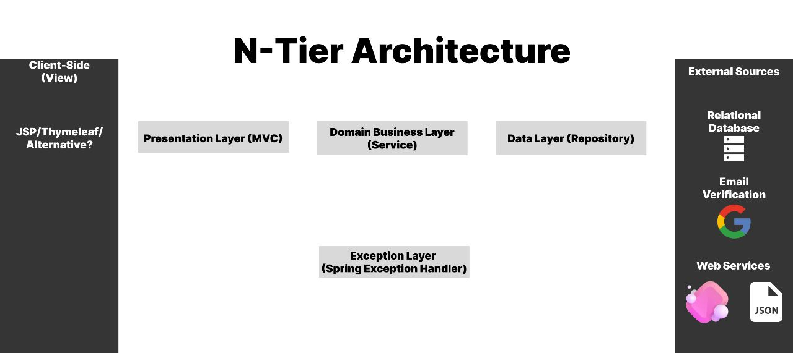
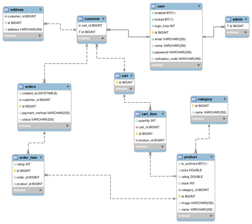

# E-Commerce

Graduation Project of VOIS Backend Discover Academy. This project is just a simple E-Commerce application designed to sell products and goods similar to Amazon and Noon.

Users can log in and register with their emails, add products to their cart, purchase products using a credit card or pay on delivery, enter their address, view their purchase history, and submit ratings for products. Admins can add categories or products and manage other admins.

## Technologies and Packages
We built this project using:
 - Java JDK 17
 - Spring Boot 3.1
 - Maven build tool

Spring Boot and Spring security are in the project dependecy POM.xml file

The following tools where used in this project
- Maven
- Tomcat
- MySQL
- Nodejs

The following services are used to serve our project:
- Credit card validation service (SOAP service)
- Credit card transaction service (REST service)

The following third-party package is used to send emails
- NodeJS Javascript runtime
- maildev (package for testing emails)

Maven is the build tool for the project and dendency manager

Nodejs is used to get a package called maildev which is used to test emails (since our machines aren't capable of sending real emails using real SMTP servers)

Tomcat is used to host and deploy card valdation and transation services

MySQL is used as our main DBMS for all SQL transactions and other services such as payment

The credit card validation service is used to validate card data from expiration, wrong number, wrong PIN, etc

The credit card transaction service is used to deduct the order amount from a particular credit card and it also validates the balance of the card

## Running the project
To run the project you need to install:
- JDK 17
- Maven
- MySQL
- Tomcat
- Nodejs
- maildev using NodeJS
after configuring all apps, you can clone this repo and run the main method located in src/main/com/vodafone/ecommerce/EcommerceApplication.java

If you encounter any error related to the database, open the application.properties and configure the credentials of MySQL to match your configuration. You also can refresh the packages in the POM.xml file.

There is an SQL script that runs every time you run the application. This script is to make sure that there is some data in the database to test with and to log in as an admin or as a customer.

## Application Architecture
We made a simple architecture for the application 

## Application Flow
We have three flows in our application:
 - Authentication flow:
 - 

 - Customer Flow:
 - 

 - Admin Flow:
 - 

## Entity Relationship Diagram for the Database
The following photo describe the ERD of the application

Conventions:
https://docs.google.com/document/d/12wXixU3w7qnmB1TurApnZDzj5Bbxh0fO
